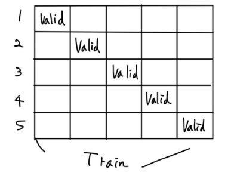
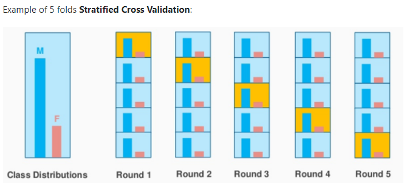

# Kfold

## K-fold

**Hold-out**

- Hold-out은 단순하게 Train 데이터를 (train, valid)라는 이름의 2개의 데이터로 나누는 작업

- 보통 train : valid = 8:2 혹은 7:3의 비율로 데이터를 나눔
- Hold-out의 문제점은 **데이터의 낭비**
- 단순하게 trian과 test로 분할하게 된다면, 20%의 데이터는 모델이 학습할 기회도 없이, 예측만하고 버려지게 된다.

**교차검증**



- "모든 데이터를 최소한 한 번씩 다 학습하게 하자!"

- 그래서 valid 데이터를 겹치지 않게 나누어 K개의 데이터셋을 만들어 낸다.
- 클래스가 편중될 가능성이 있어서 `shuffle=True`로 분할하기전에 섞기 때문에 편중될 확률이 줄어들기는 한다.

https://scikit-learn.org/stable/modules/generated/sklearn.model_selection.KFold.html?highlight=kfold#sklearn.model_selection.KFold

```python
X = train.drop(columns = ['index','quality'])
y = train['quality']

kf = KFold(n_splits = 5, shuffle = True, random_state = 0)
# shuffle=True면 random_state지정해줘야함
model = RandomForestClassifier(random_state = 0)
valid_scores = []
test_predictions = []

for train_idx, valid_idx in kf.split(X,y) : 
  X_tr = X.iloc[train_idx]
  y_tr = y.iloc[train_idx]

  X_val = X.iloc[valid_idx]
  y_val = y.iloc[valid_idx]

  model.fit(X_tr, y_tr)
  
  valid_prediction = model.predict(X_val)
  score = accuracy_score(y_val, valid_prediction)
  valid_scores.append(score)
  print(score)
print('평균 점수 : ', np.mean(valid_scores))

```

## StratifiedKFold

**불균형한 분포도를 가진 레이블 데이터를 위한 방식**

금융거래 사기 분류 모델에서 전체 데이터중 정상 거래 건수는 95% 사기인 거래건수는 5% 라면, 앞서 설명한 일반적인 교차 검증으로 데이터를 분할했을 때, 사기 거래 건수가 고루 분할 되지 못하고 한 분할에 몰릴 수 있다. 이때 데이터 클래스 별 분포를 고려해서 데이터 폴드 세트를 만드는 방법이 StratifiedKFold

https://scikit-learn.org/stable/modules/generated/sklearn.model_selection.StratifiedKFold.html

This cross-validation object is a variation of KFold that returns stratified folds. The folds are made by preserving the percentage of samples for each class.



