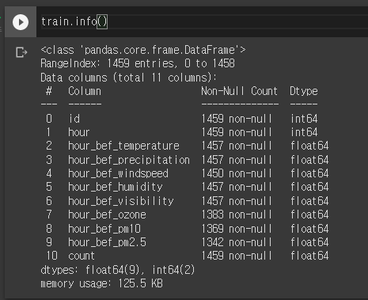
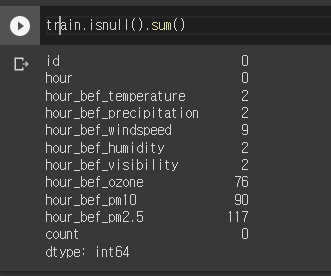
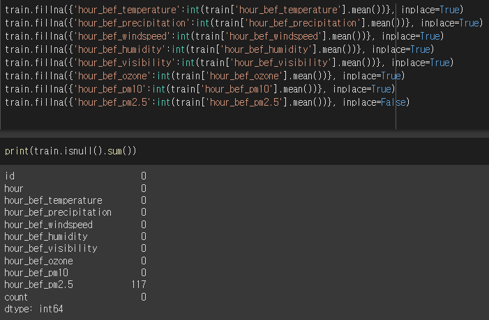
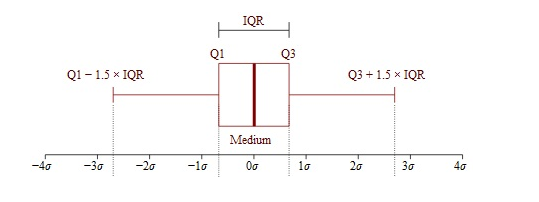

# 전처리

## 결측치란

- 분석 결과/인사이트와 모델 성능에 직접적인 영향을 미치는 과정이기 때문에 중요하게 다루어지는 과정

- 한 설문조사에 의하면, 분석가의 80% 시간을 데이터 수집 및 전처리에 사용한다고 하니, 얼마나 중요한 과정인지 짐작할 수 있다. 물론 지루하고 반복 작업의 연속이기 때문에 시간이 많이 들어가는 측면도 있을 것이다.

패턴이 있는 것과 패턴이 없는 것이 있음

## 결측치 처리

1) 결측치 사례 제거 
2)  수치형의 경우 평균이나 중앙치로 대체(imputation)하거나 범주형인 경우 mode 값으로 대체 
3)  간단한 예측 모델로 대체하는 방식이 일반적으로 이용된다. 

가장 쉬운 방법은 Null이 포함 행 혹은 일부 행을 제거하는 것이다

### Missing Value 파악

데이터셋을 읽었다면, Missing Value 파악을 위해 `df.info()` 가장 처음에 이용하는 것을 추천

**DataFrame.info()**



**DataFrame.isnull().sum()**



### 제거

#### dropna 

- 결측치의 특성이 '무작위로 손실' 되지 않았다면, 대부분의 경우 가장 좋은 방법은 **제거**하는 것이다.

https://pandas.pydata.org/docs/reference/api/pandas.DataFrame.dropna.html

- pandas에서 제공하는 Na/NaN과 같은 누락 데이터를 제거하는 함수입니다.
- axis: 파라미터 값으로 0을 주면 행 제거, 1을 주면 열 제거입니다. default값은 0입니다.
- subset: array, 특정 feature를 지정하여 해당 Feature의 누락 데이터 제거가 가능합니다.

```python
# 목록삭제(Listwise)

df = df.dropna() # 결측치가 있는 행은 전부 삭제
    
df = df.dropna(axis = 1) # 결측치가 있는 열은 전부 삭제

# 단일값 삭제(Pairwise)

df = df.dropna(how = 'all') # 행 전체가 결측치인 행만 삭제

df = df.dropna(thresh = 2) # 행의 결측치가 2개 초과인 행만 삭제

# 특정 열들중에 결측치가 있을 경우에 해당 행을 삭제
df = df.dropna(subset=['col1', 'col2', 'col3'])

# 특정열 모두가 결측치일 경우 해당 행 삭제
df = df.dropna(subset=['col1', 'col2', 'col3'], how = 'all')

# 특정열에 1개 초과의 결측치가 있을 경우 해당 행 삭제
df = df.dropna(subset=['col1', 'col2', 'col3'], thresh = 1 )
```


### 대체

대체값 종류

- 최빈값(mode)
  - 범주형에서 결측값이 발생시, 범주별 빈도가 가장 높은 값으로 대치한다.
- 중앙값(median)
  - 숫자형(연속형)에서 결측값을 제외한 중앙값으로 대치방법
- 평균(mean)
  - 숫자형(연속형)에서 결측값제외한 평균으로 대치방법
- Similar case Imputation
  - 조건부 대치
- Generalized Imputation
  - 회귀분석을 이용한 대치

#### fillna 

https://pandas.pydata.org/docs/reference/api/pandas.DataFrame.fillna.html

```python
df.fillna(0) # 전체 결측치를 특정 단일값으로 대체하기

# 특정열에 결측치가 있을 경우 다른 값으로 대체하기

# 0으로 대체하기
df['col'] = df['col'].fillna(0)

# 컬럼의 평균으로 대체하기
df['col'] = df['col'].fillna(df['col'].mean())

# 결측치 바로 이전 값으로 채우기
df.fillna(method = 'pad')

# 결측치 바로 이후 값으로 채우기
df.fillna(method = 'bfill')
```

#### replace

https://pandas.pydata.org/docs/reference/api/pandas.DataFrame.replace.html

```python
# 결측치 값을 -50으로 채운다.
df.replace(to_replace = np.nan, value = -50)
```


#### interpolate(보간법)

https://pandas.pydata.org/docs/reference/api/pandas.DataFrame.interpolate.html

```python
# interpolate는 인덱스를 무시하고 값들을 선형적으로 같은 간격으로 처리하게 된다.
df.interpolate(method = 'linear')
#  ‘linear’: Ignore the index and treat the values as equally spaced - Default
```

inplace의 의미



## 이상치

### 방법

IQR 방식은 75% percentile + 1.5 * IQR 이상이거나 25 percentile - 1.5 * IQR 이하인 경우 극단치로 처리하는 방식이다. 이해하기 쉽고 적용하기 쉬운 편이지만, 경우에 따라 너무 많은 사례들이 극단치로 고려되는 경우가 있다.




```python
# IQR 기반 예제 코드
def outliers_iqr(ys):
    quartile_1, quartile_3 = np.percentile(ys, [25, 75])
    iqr = quartile_3 - quartile_1
    lower_bound = quartile_1 - (iqr * 1.5)
    upper_bound = quartile_3 + (iqr * 1.5)
    return np.where((ys > upper_bound) | (ys < lower_bound))
```

