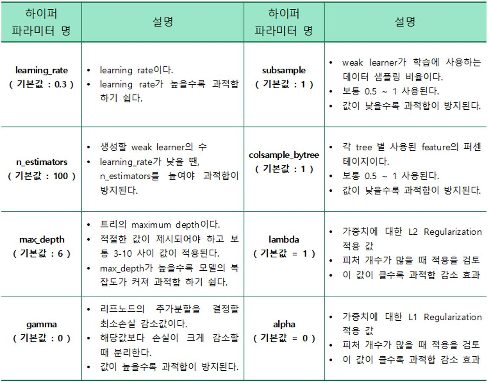
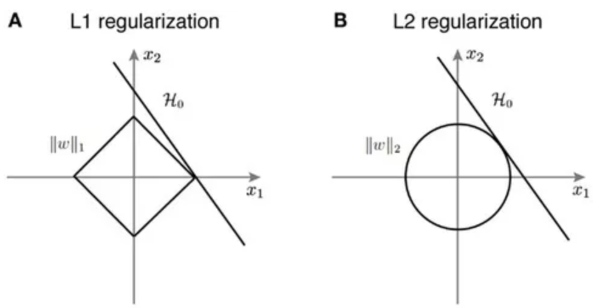

Bayesian Optimization 을 이용해 모델을 튜닝

현재까지 얻어진 모델의 파라미터와 추가적인 실험 정보를 통해 **데이터가 주어 졌을 때 모델의 성능이 가장 좋을 확률이 높은 파라미터를 찾아냅니다.**


# 모델 튜닝

## XGBoost 모델 튜닝



### learning rate(학습률)

[경사하강법](https://velog.io/@sasganamabeer/AI-Gradient-Descent%EA%B2%BD%EC%82%AC%ED%95%98%EA%B0%95%EB%B2%95)

> 경사하강법(Gradient Descent)은 1차 근삿값 발견용 **최적화 알고리즘**이다. 기본 개념은 함수의 기울기(경사)를 구하고 경사의 절댓값이 낮은 쪽으로 계속 이동시켜 극값에 이를 때까지 반복시키는 것이다.

- 취솟값을 구하기 위해 미분계수 계산 과정을 컴퓨터로 구현하는 것보다, **경사하강법을 구현하는 것이 훨씬 쉬움**

- 데이터의 양이 매우 큰 경우 경사하강법과 같은 순차적인 방법이 **계산량 측면에서 훨씬 효율적**

- **공식**

  - 경사하강법은 **함수의 기울기(=gradient)를 이용해서 함수의 최소값 일 때의 x값을 찾기 위한 방법**이다. 기울기가 양수인 경우는 *x* 값이 증가할수록 함수 값도 증가하고, 반대로 음수인 경우에는 *x* 값이 증가할수록 함수 값이 감소한다. 그리고 기울기 값이 크다, 기울기가 가파르다는 것은 최소값으로부터 거리가 멀다는 뜻이다.

    .assets/image-20220502230520657.png)

    기울기가 양수면 x를 음의 방향으로, 기울기가 음수면 x를 양의 방향으로 x를 이동시킨다.

    .assets/image-20220502230748658.png)

    미분 계수(=기울기=gradient)는 극소값에 가까워질수록 값이 작아진다. 따라서, **이동거리에는 미분 계수와 비례하는 값을 이용**한다. 그럼 극소값에서 멀 때는 많이 이동하고, 극소값에 가까울 때는 조금씩 이동할 수 있다.

    .assets/image-20220502230822164.png)

    > .assets/image-20220502230848119.png)

    

- 경사하강법 알고리즘은 기울기에 learning rate 또는 step size라고 불리는 스칼라를 곱해서 다음지점을 결정한다.

  .assets/image-20220502193613401.png)

learning rate(step size)이 크면 데이터가 무질서하게 이탈해서 최저점에 수렴하지 못하고 learning rate(step size)가 작으면 학습시간이 오래걸려서 최저점에 도달하지 못한다. 적절할 값을 설정해줘야한다. [최종 학습시에는 0.05 이하의 값을 사용하여 모형 성능 향상에 초점을 맞추고, 하이퍼파라미터 튜닝시에는 0.1이상의 값을 사용하여 학습속도를 높이는 것이 좋다.](https://psystat.tistory.com/131)

**gamma**

- gain - gamma < 0 이면 해당 분기점은 없어진다.

- gamma 값에 따라 분할할지 말지 정할 수도 있음
- https://gwoolab.tistory.com/31

**[lambda, alpha](https://wooono.tistory.com/221)**

- **L1 Regularization** 과 **L2 Regularization** 모두 **Overfitting(과적합)** 을 막기 위해 사용
- L1 Regularization은 가중치 업데이트 시, 가중치의 크기에 상관 없이 상수값을 빼면서 진행
- L2 Regularization은 가중치 업데이트 시, 가중치의 크기가 직접적인 영향을 미침
- 다만, L1 Regularization은 아래 그림처럼 미분 불가능한 점이 있기 때문에 Gradient-base learning 에는 주의가 필요

- 따라서, L2는 L1 보다 가중치 규제에 좀 더 효과적



## Light GBM 모델 튜닝


**min_child_samples**

- **min_child_samples** 파라미터는 최종 결정 클래스인 Leaf Node가 되기 위해서 최소한으로 필요한 **데이터 개체의 수**를 의미하며, 과적합을 제어하는 파라미터이다. 이 파라미터의 최적값은 훈련 데이터의 개수와 **num_leaves**에 의해 결정된다. 너무 큰 숫자로 설정하면 under-fitting이 일어날 수 있으며, 아주 큰 데이터셋이라면 적어도 수백~수천 정도로 가정하는 것이 편리하다.
  - **num_leaves** 파라미터는 하나의 트리가 가질 수 있는 최대 리프의 개수인데, 이 개수를 높이면 정확도는 높아지지만 트리의 깊이가 커져 모델의 복잡도가 증가한다는 점에 유의해야 한다.


## 코드

### XGBoost

```python
# 튜닝된 파라미터를 바탕으로 test 데이터 셋 예측(실습)

#학습
xgb_tune =XGBClassifier(gamma = 4.376,max_depth = 3, subsample = 0.9818)
xgb_tune.fit(X,y)


#예측
pred = xgb_tune.predict(test.drop(columns = ['index'] ))

#정답파일 내보내기
sub = pd.read_csv('data/sample_submission.csv')
sub['quality'] = pred
sub.to_csv('tune_xgb.csv',index = False)

#0.573

# 튜닝된 파라미터를 바탕으로 test 데이터 셋 예측(max_params)

#학습
xgb_tune =XGBClassifier(gamma = 3.852,max_depth = 2, subsample = 0.8105)
xgb_tune.fit(X,y)


#예측
pred = xgb_tune.predict(test.drop(columns = ['index'] ))

#정답파일 내보내기
sub = pd.read_csv('data/sample_submission.csv')
sub['quality'] = pred
sub.to_csv('tune_xgb_lwt.csv',index = False)

#0.567
```


### light gbm

```python
max_params = BO_lgbm.max['params']

max_params['max_depth'] = float(max_params['max_depth'])
max_params['n_estimators'] = float(max_params['n_estimators'])
max_params['subsample'] = float(max_params['subsample'])
print(max_params)
# {'max_depth': 2.5563135018997007, 'n_estimators': 90.90085037727735, 'subsample': 0.989309171116382}


# 튜닝된 파라미터를 바탕으로 test 데이터 셋 예측(실습내용)

#학습
lgbm_tune =LGBMClassifier(n_estimators = 43 ,max_depth = 3, subsample = 1)
lgbm_tune.fit(X,y)


#예측
pred = lgbm_tune.predict(test.drop(columns = ['index'] ))

#정답파일 내보내기
sub = pd.read_csv('data/sample_submission.csv')
sub['quality'] = pred
sub.to_csv('tune_lgbm.csv',index = False)
# 0.57199

# 튜닝된 파라미터를 바탕으로 test 데이터 셋 예측(max_params적용)

#학습
lgbm_tune =LGBMClassifier(n_estimators = 91 ,max_depth = 3, subsample = 1)
lgbm_tune.fit(X,y)


#예측
pred = lgbm_tune.predict(test.drop(columns = ['index'] ))

#정답파일 내보내기
sub = pd.read_csv('data/sample_submission.csv')
sub['quality'] = pred
sub.to_csv('tune_lgbm_lwt.csv',index = False)
# 0.57699
```


# voting classifier

```python
# 모델 정의 (튜닝된 파라미터로)(실습)
LGBM = LGBMClassifier(max_depth = 3,n_estimators=60, subsample = 0.8229)
XGB = XGBClassifier(gamma =  4.376, max_depth = 3, subsample = 0.9818)
RF = RandomForestClassifier(max_depth = 3, n_estimators = 35) # float값이 안들어가서 몇개는 반올림 해줌

# VotingClassifier 정의
VC = VotingClassifier(estimators=[('rf',RF),('xgb',XGB),('lgbm',LGBM)],voting = 'soft')
# 0.555

# 모델 정의 (튜닝된 파라미터로)(max_params적용))
LGBM = LGBMClassifier(max_depth = 3,n_estimators=100, subsample = 1)
XGB = XGBClassifier(gamma =  4, max_depth = 1, subsample = 1)
RF = RandomForestClassifier(max_depth = 3, n_estimators = 100)

# VotingClassifier 정의
VC = VotingClassifier(estimators=[('rf',RF),('xgb',XGB),('lgbm',LGBM)],voting = 'soft')
# 0.556

# 0.001차이로 max_params가 높음
```


